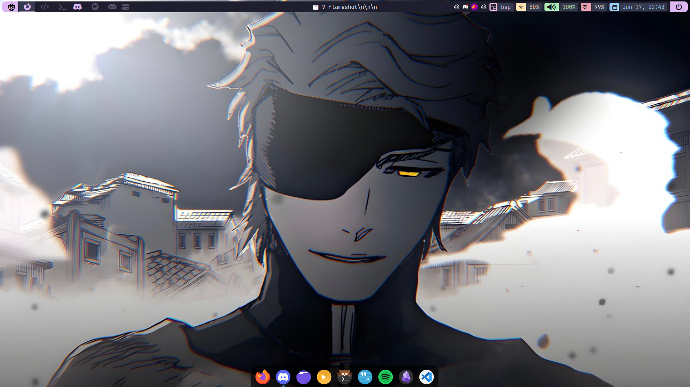
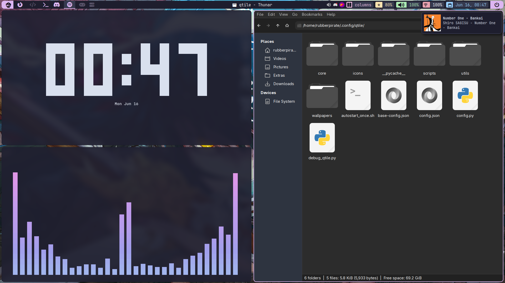
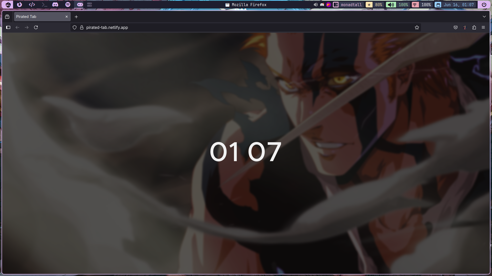
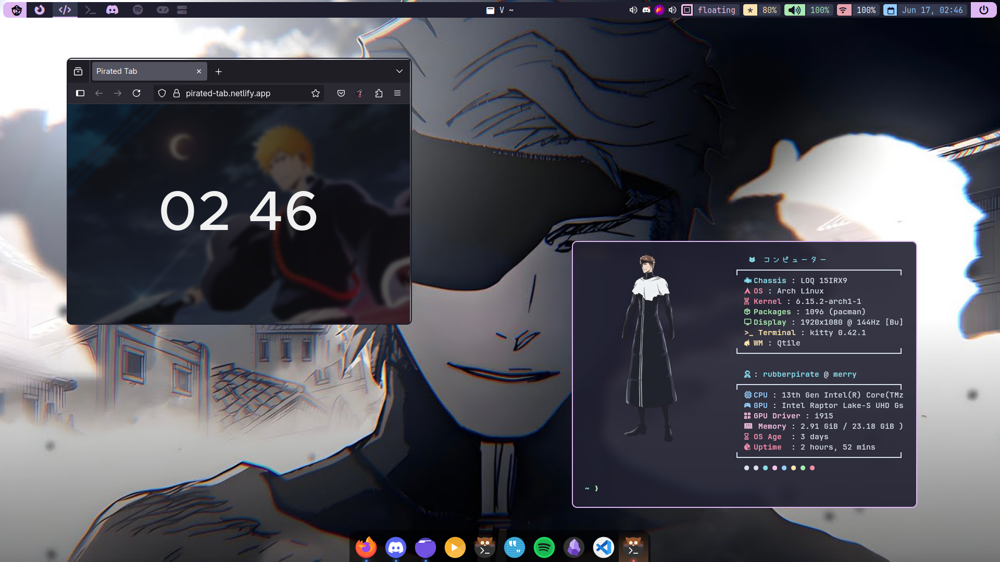

#  Ky-Suigetsu - Qtile Configuration

*"Just as Kyōka Suigetsu creates perfect illusions, this config is the perfect desktop environment for multitasking with fun"*

A Qtile setup that delivers Hyprland-smooth performance with rock-solid X11 stability. Born from the quest to find a window manager that combines Hyprland's fluidity with GNOME's feature completeness, without the breakage.

https://github.com/user-attachments/assets/b0f48427-d5a2-43e0-bac8-b0ca96f36eb0

<table>
  <tr>
    <td></td>
    <td></td>
  </tr>
  <tr>
    <td></td>
    <td></td>
  </tr>
</table>

## 📋 System Information

- **OS**: Arch Linux
- **WM**: Qtile with qtile-extras
- **Terminal**: Kitty
- **Shell**: Zsh
- **Bar**: Qtile's built-in bar
- **Launcher & Power Menu**: Rofi
- **Browser**: Firefox
- **Fonts**: 
  - JetBrainsMono Nerd Font (main text)
  - Font Awesome 6 Free (bar icons)
- **GTK Theme**: Tokyo Night
- **File Manager**: Thunar
- **Editors**: 
  - Neovim (custom config)
  - VSCode
- **Fetch**: Fastfetch
- **Compositor**: Picom
- **Color Scheme**: Catppuccin

## 📁 Directory Structure

```
.config/qtile/
├── autostart_once.sh          # One-time startup script
├── base-config.json           # Base configuration
├── config.json               # Main configuration file
├── config.py                 # Main Qtile config
├── core/                     # Core configuration modules
│   ├── bar.py               # Status bar configuration
│   ├── groups.py            # Workspace groups
│   ├── hooks.py             # Qtile hooks
│   ├── keys.py              # Keybinding definitions
│   ├── layouts.py           # Window layouts
│   ├── mouse.py             # Mouse bindings
│   ├── screens.py           # Screen configuration
│   └── widgets.py           # Custom widgets
├── debug_qtile.py            # Debug utilities
├── icons/                    # Layout and custom icons
├── scripts/                  # Utility scripts
│   ├── autostart.sh         # Autostart applications
│   ├── config_xrandr.sh     # Display configuration
│   ├── lock.sh              # Screen locking
│   ├── temp_vol.sh          # Volume control
│   ├── toggle_eww.sh        # EWW dashboard toggle
│   └── vol_icon.sh          # Volume icon handler
├── utils/                    # Utility modules
│   ├── colorscheme/         # Color scheme definitions
│   ├── colors.py            # Color management
│   ├── dir.py               # Directory utilities
│   ├── settings.py          # Configuration settings
│   └── variables.py         # Global variables
└── wallpapers/              # Wallpaper collection
```

## 🎯 Philosophy

**Ky-Suigetsu** represents my second attempt at the perfect Qtile configuration, born from extensive experimentation with various window managers:

- **Why not Hyprland?** Amazing smoothness, but prone to breaking with updates
- **Why not Sway?** Wayland-only caused compatibility issues with docks and various applications  
- **Why Qtile?** The sweet spot - Hyprland-level smoothness with X11 stability and GNOME-like features

This configuration prioritizes **reliability without sacrificing aesthetics** - perfect for daily driving without the constant tweaking.

## ⚡ Key Features

- **Hyprland-Smooth Performance**: Fluid animations and responsive window management on stable X11
- **GNOME-Like Integration**: Seamless dock support, system tray, and desktop environment features
- **Modular Architecture**: Clean separation of concerns with organized modules
- **Custom Keybindings**: Intuitive key combinations inspired by modern WM workflows
- **Multiple Layouts**: BSP, Columns, and other tiling layouts for different workflows
- **Dynamic Theming**: Support for multiple color schemes (Catppuccin, Nord)
- **Integrated Scripts**: Custom scripts for volume, brightness, and system management
- **Rich Icon Support**: Custom layout icons and Font Awesome integration
- **Rofi Integration**: Beautiful launcher and power menu that actually works
- **Scratch Pads**: Quick access terminal and system monitor
- **X11 Compatibility**: Full support for docks, system trays, and legacy applications

## 🎯 Key Bindings

### Essential Commands
- `Super + Return` - Launch terminal
- `Super + q` - Kill active window
- `Super + Tab` - Next layout
- `Super + Shift + Tab` - Previous layout
- `Super + Shift + r` - Restart Qtile

### Application Launchers
- `Super + d` - Rofi launcher
- `Super + f` - Firefox
- `Super + e` - Thunar (file manager)
- `Super + c` - VSCode
- `Super + n` - Notion
- `Super + s` - Spotify

### Window Management
- `Super + Arrow Keys` - Focus windows
- `Super + Shift + Arrow Keys` - Move windows
- `Super + Alt + Arrow Keys` - Resize windows
- `Super + m` - Toggle maximize
- `Super + Shift + f` - Toggle fullscreen
- `Super + i` - Toggle floating

### System Controls
- `Super + t` - Toggle scratch terminal
- `Super + Shift + t` - Toggle btop terminal
- `Super + Shift + e` - Power menu
- `Super + Shift + n` - Network menu
- `Print` - Screenshot (full screen)
- `Super + Print` - Screenshot (region)

### Key Chords (Super + l)
- `a` - Aseprite
- `d` - Discord
- `m` - Gnome Mahjongg
- `t` - Copy GitHub token
- `e` - Custom editor

## 🔧 Installation

### Prerequisites

Make sure you have the following packages installed:

```bash
# Essential packages
sudo pacman -S qtile python-psutil python-xcffib xorg

# AUR packages (using yay)
yay -S qtile-extras

# Additional dependencies
yay -S kitty rofi firefox thunar picom brightnessctl playerctl flameshot fastfetch sddm
```

### Installation Steps

1. **Clone the repository:**
   ```bash
   git clone https://github.com/yourusername/ky-suigetsu.git
   cd ky-suigetsu
   ```

2. **Running the script:**
   ```bash
   chmod +x ky.sh
   ./ky.sh
   ```


## 🎨 Customization

### Changing Color Schemes

The configuration supports multiple color schemes located in `utils/colorscheme/`:
- Catppuccin (default)
- Nord

To switch color schemes, edit `config.json` and change the colorscheme value.

### Adding New Keybindings

Keybindings are defined in `core/keys.py`. Follow the existing pattern to add new bindings:

```python
Key([mod], "your_key", lazy.spawn("your_command"), desc="Description"),
```

### Customizing the Bar

Bar configuration is in `core/bar.py`. You can modify widgets, add new ones, or change the layout.

### Adding Wallpapers

Place new wallpapers in the `wallpapers/` directory. The configuration will automatically detect them.

## 🐛 Troubleshooting

### Common Issues

1. **Qtile won't start**: Check the logs with `qtile cmd-obj -o cmd -f logs`
2. **Missing dependencies**: Ensure all required packages are installed
3. **Scripts not working**: Verify script permissions with `ls -la ~/.config/qtile/scripts/`

### Debug Mode

Use `debug_qtile.py` for troubleshooting configuration issues.

## 📝 Contributing

Feel free to submit issues, suggestions, or pull requests to improve this configuration!
---

*"Complete Hypnosis" - A desktop environment so smooth and stable, you'll forget you're using a tiling window manager.*

**Note**: Don't forget to add a screenshot of your desktop to showcase the Ky-Suigetsu experience!
